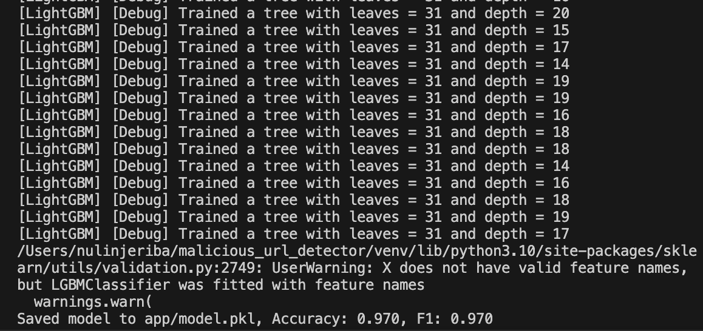
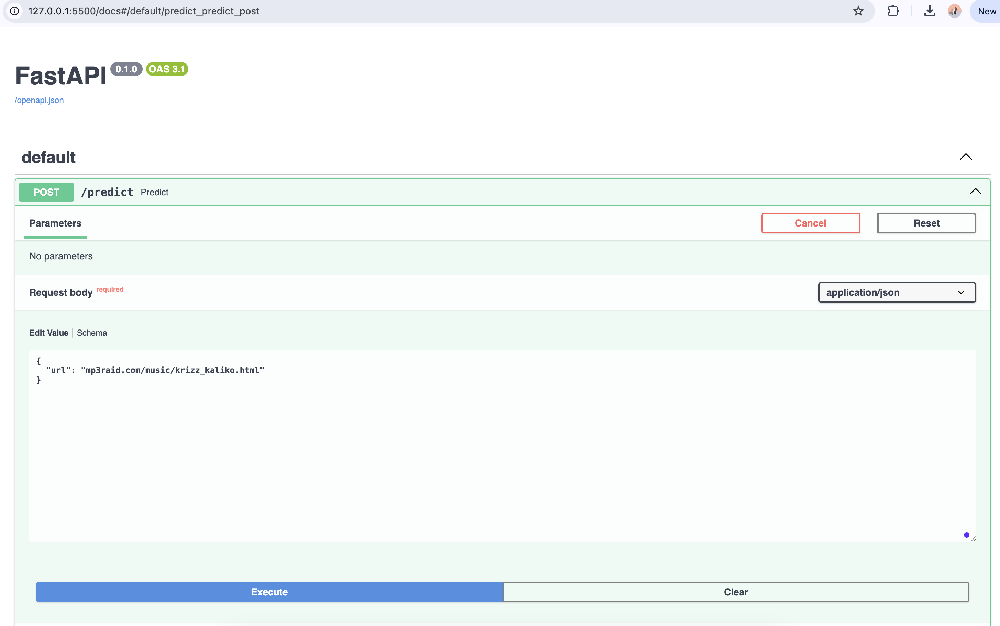
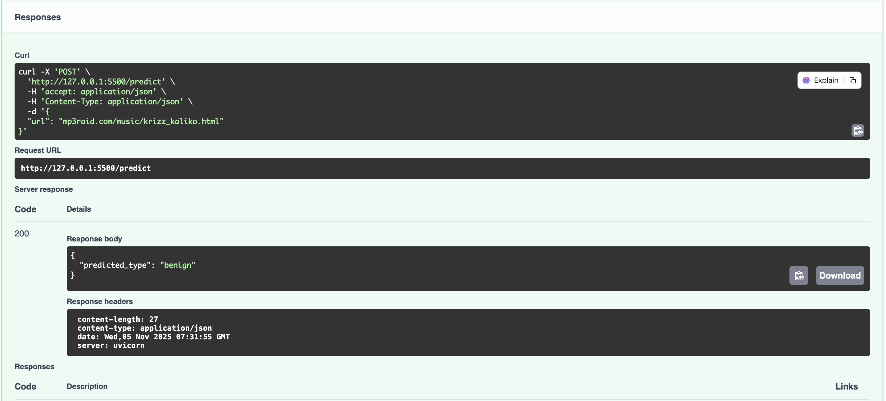

# 🚦 Malicious URL Detection API

A Python-based machine learning service for detecting malicious URLs, built with FastAPI and LightGBM, featuring advanced feature extraction.

## Features

- Robust ML pipeline with TF-IDF and engineered URL features
- Model trained on large-scale, real-world malicious URL datasets (not included for privacy/size)
- FastAPI-powered RESTful API for easy integration and rapid predictions
- Ready for deployment, extensible for batch processing or web frontend integration
- Achieves high test accuracy (>97%) on benchmark datasets

## Setup Instructions

1. **Clone the repository:**
```
git clone https://github.com/yourusername/malicious-url-detector.git
cd malicious-url-detector
```

2. **Create and activate virtual environment:**
```
python3 -m venv venv
source venv/bin/activate
```
3. **Install dependencies:**
```
pip install -r requirements.txt
```

4. **Add your dataset (not tracked in git):**
- Place your `malicious_urls.csv` in the project root (same as README location).

5. **Train the model:**
```
python -c "from app.model import train_and_save; train_and_save('malicious_urls.csv')"
```
6. **Start the API server:**

```
uvicorn app.main:app --reload --port 8000
```

7. **Test the API:**
- Use Swagger docs [http://127.0.0.1:8000/docs](http://127.0.0.1:8000/docs)
- Or curl:
  ```
  curl -X POST http://127.0.0.1:8000/predict -H "Content-Type: application/json" -d '{"url":"http://example.com"}'
  ```
## 📸 Screenshots

### 1. Model Training Output


This screenshot shows the terminal output after training the LightGBM-based malicious URL detection model.
It includes the number of trees trained, leaf and depth info, and the final model performance metrics (Accuracy and F1-score).

---

### 2. FastAPI Server Running


This screenshot demonstrates the FastAPI server running locally via Uvicorn, showing that the REST API service for malicious URL detection is up and ready to receive requests.

---

### 3. Prediction via Swagger UI


This screenshot captures the use of FastAPI's interactive Swagger UI. It shows submitting a POST request to the `/predict` endpoint, sending a sample URL, and receiving a real-time prediction label from the machine learning model.

## Notes

- **Dataset:** Due to size, the main malicious URL dataset should NOT be committed to git. Download and place locally.
- **Trained Model:** `app/model.pkl` is produced after training; this is ignored by git.
- **Customization:** Feature extraction and model parameters are easily tweakable in `model.py`.

## License

MIT (update as appropriate)

## Author

Nulin Jeriba, [nulinjeriba25@gmail.com]


